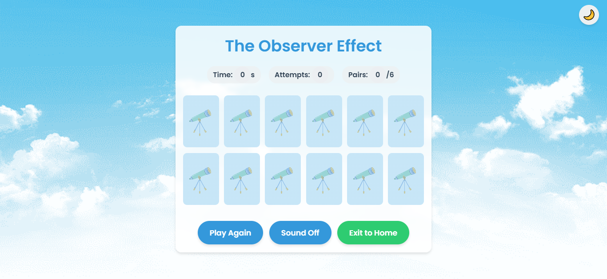

# The observer Effect

## Date: 11-9-2025

## By: Fatima Ali

***
### Description
### A creative journey into the world of game development! This repository documents my adventure in turning ideas into interactive reality through the memory game I developed. Every line of code here represents a step in my journey to learn how to design enjoyable and functional user experiences.

***

### Technologies used
 * HTML
 * CSS
 * JavaScript

***
### Screenshots
### imge 1

### imge 2

### imge 3

### imge 4

![physic]

### Future Updates
- [ ] Game timer
- [ ] Customizable cards
- [ ] Night mode
- [ ] Best score save

***

### Credits
[Markdown Guide](https://www.markdownguide.org/cheat-sheet/) - Markdown reference
Images used are for illustrative purposes only.
***
